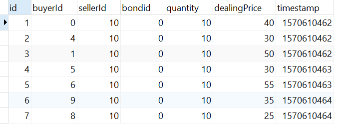

# 简单交易撮合系统使用文档

## 简介

该简单交易撮合系统采用内存撮合模型，能够支持多用户，多种债券进行交易

采用内存撮合模型，所有交易在内存中进行，通过避免交易过程中与DB 进行IO，能够提高交易速度；内存交易撮合完成后，将交易撮合信息传送至消息队列中，异步地在DB中持久化

该系统支持：

- 多个用户，多种债券进行交易
- 增加用户和债券，模拟企业发行债券和用户注册
- 支持用户提交买卖挂单请求
- 支持实时监控债券
- 仅支持限价交易

**项目中 `测试.sh` 脚本文件提供了 对于交易撮合的模拟过程**

### 后续功能完善

- 根据内存撮合信息，在DB中进行撮合
- 增加并发请求响应支持
- 增加内存撮合计算冗余备份，降低由内存易失性带来的问题

## 启动及初始化

### Springboot启动

- 运行MatchingSystemApplication.main方法
- 运行matching-system-0.0.1-SNAPSHOT.jar jar包

服务在8080端口启动

### MySQL初始化

1. DB用户及密码

```properties
username=root
password=root
```

2. 建立 matchingsystem 数据库
3. 运行 .\src\main\resources\createTable.sql 建立表

## API及使用说明

### 增加用户与债券

#### 增加用户

**使用方式**

```bash
curl -X POST http://localhost:8080/init/addUser  -d "money=100000"
```

**参数说明**

| 参数         | 内容                               | 类型    | 说明          |
| ------------ | ---------------------------------- | ------- | ------------- |
| 请求方式     | POST                               |         | POST请求      |
| Url          | http://localhost:8080/init/addUser |         | URL           |
| RequestParam | money                              | Integer | 不小于0的整数 |

**返回值**

```json
{
    "code": 2201,
    "msg": "添加用户成功",
    "data": {
        "id": 2,
        "aliveMoney": 10000,
        "frozenMoney": 0,
        "bonds": {},
        "totalMoney": 10000
    }
}
```

**返回值说明**

| 参数 | 类型    | 说明                   |
| ---- | ------- | ---------------------- |
| code | Integer | 状态码，详见状态码说明 |
| msg  | String  | 状态码说明             |
| data | json    | 成功添加的用户信息     |

#### 增加债券

**使用方式**

```bash
curl -X POST http://localhost:8080/init/addBond  -d "quantity=100&userId=10"
```

**参数说明**

| 参数         | 内容                               | 类型    | 说明             |
| ------------ | ---------------------------------- | ------- | ---------------- |
| 请求方式     | POST                               |         | POST请求         |
| Url          | http://localhost:8080/init/addBond |         | URL              |
| RequestParam | quantity                           | Integer | 不小于0的整数    |
|              | userId                             | Integer | 已经存在的用户Id |

**返回值**

```json
{
    "code": 2202,
    "msg": "添加债券成功",
    "data": {
        "id": 10,
        "quantity": 10
    }
}
```

**返回值说明**

| 参数 | 类型    | 说明                   |
| ---- | ------- | ---------------------- |
| code | Integer | 状态码，详见状态码说明 |
| msg  | String  | 状态码说明             |
| data | json    | 成功添加的用户信息     |

###挂单请求

#### 提交买挂单请求

**使用方式**

```bash
curl --request POST --url http://localhost:8080/transaction/buy  --header 'Content-Type: application/json' --data '{"userId": 0, "bondId": 0,"quantity": 10,"price": 40}'
```

**参数说明**

| 参数                                   | 内容                                  | 类型    | 说明                       |
| -------------------------------------- | ------------------------------------- | ------- | -------------------------- |
| 请求方式                               | POST                                  |         | POST请求                   |
| Url                                    | http://localhost:8080/transaction/buy |         | URL                        |
| header'Content-Type: application/json' |                                       | json    | 使用json传输               |
| data                                   | userId                                | Integer | 买方用户Id，需保证已经存在 |
|                                        | bondId                                | Integer | 债券Id，需保证已经存在     |
|                                        | quantity                              | Integer | 待购买债券数量；不小于0    |
|                                        | price                                 | Integer | 上限交易限价；不小于0      |

**返回值**

```json
{
    "code": 2101,
    "msg": "购买提交成功",
    "data": null
}
```

**返回值说明**

| 参数 | 类型    | 说明                   |
| ---- | ------- | ---------------------- |
| code | Integer | 状态码，详见状态码说明 |
| msg  | String  | 状态码说明             |
| data | json    | null                   |

#### 提交卖挂单请求

**使用方式**

```bash
curl --request POST --url http://localhost:8080/transaction/sale  --header 'Content-Type: application/json' --data '{"userId": 10, "bondId": 0,"quantity": 20,"price": 5}'
```

**参数说明**

| 参数                                   | 内容                                   | 类型    | 说明                                 |
| -------------------------------------- | -------------------------------------- | ------- | ------------------------------------ |
| 请求方式                               | POST                                   |         | POST请求                             |
| Url                                    | http://localhost:8080/transaction/sale |         | URL                                  |
| header'Content-Type: application/json' |                                        | json    | 使用json传输                         |
| data                                   | userId                                 | Integer | 卖方用户Id，需保证已经存在           |
|                                        | bondId                                 | Integer | 债券Id，需保证该用户持有该债券       |
|                                        | quantity                               | Integer | 待出售债券数量；需保证该用户足量债券 |
|                                        | price                                  | Integer | 下限交易限价；不小于0                |

**返回值**

```json
{
    "code": 2101,
    "msg": "出售提交成功",
    "data": null
}
```

**返回值说明**

| 参数 | 类型    | 说明                   |
| ---- | ------- | ---------------------- |
| code | Integer | 状态码，详见状态码说明 |
| msg  | String  | 状态码说明             |
| data | json    | null                   |

### 交易

**说明**

挂单提交后不会立即进行交易（市场上可能没有能够撮合的交易），等待撮合成功后，产生交易

交易信息输出至：

- 日志文件 路径 :`${sys:user.home}/logs/matching-system/`
- 消息队列，异步地持久化至DB

示例：

#### **日志文件**

```verilog
21:26:40.949 [http-nio-8080-exec-3] INFO  top.erricliu.huatai.matchingsystem.service.TransactionService - bill: {"userId":0,"boundId":0,"tradeType":"BUY","price":40,"quantity":10,"initTime":"Oct 9, 2019 9:26:40 PM","currentTime":"Oct 9, 2019 9:26:40 PM"}
21:26:41.080 [http-nio-8080-exec-9] INFO  top.erricliu.huatai.matchingsystem.service.TransactionService - bill: {"userId":1,"boundId":0,"tradeType":"BUY","price":50,"quantity":10,"initTime":"Oct 9, 2019 9:26:41 PM","currentTime":"Oct 9, 2019 9:26:41 PM"}
21:26:41.220 [http-nio-8080-exec-1] INFO  top.erricliu.huatai.matchingsystem.service.TransactionService - bill: {"userId":2,"boundId":0,"tradeType":"BUY","price":10,"quantity":10,"initTime":"Oct 9, 2019 9:26:41 PM","currentTime":"Oct 9, 2019 9:26:41 PM"}
21:26:41.364 [http-nio-8080-exec-8] INFO  top.erricliu.huatai.matchingsystem.service.TransactionService - bill: {"userId":3,"boundId":0,"tradeType":"BUY","price":20,"quantity":10,"initTime":"Oct 9, 2019 9:26:41 PM","currentTime":"Oct 9, 2019 9:26:41 PM"}
21:26:41.494 [http-nio-8080-exec-2] INFO  top.erricliu.huatai.matchingsystem.service.TransactionService - bill: {"userId":4,"boundId":0,"tradeType":"BUY","price":30,"quantity":10,"initTime":"Oct 9, 2019 9:26:41 PM","currentTime":"Oct 9, 2019 9:26:41 PM"}
21:26:41.620 [http-nio-8080-exec-6] INFO  top.erricliu.huatai.matchingsystem.service.TransactionService - bill: {"userId":10,"boundId":0,"tradeType":"SALE","price":30,"quantity":40,"initTime":"Oct 9, 2019 9:26:41 PM","currentTime":"Oct 9, 2019 9:26:41 PM"}
21:26:41.622 [http-nio-8080-exec-6] INFO  top.erricliu.huatai.matchingsystem.service.ClearingService - transaction deal:{"buyerId":1,"sellerId":10,"bondId":0,"quantity":10,"dealingPrice":50,"timestamp":"Oct 9, 2019 9:26:41 PM"}
21:26:41.623 [http-nio-8080-exec-6] INFO  top.erricliu.huatai.matchingsystem.service.ClearingService - transaction deal:{"buyerId":0,"sellerId":10,"bondId":0,"quantity":10,"dealingPrice":40,"timestamp":"Oct 9, 2019 9:26:41 PM"}
21:26:41.623 [http-nio-8080-exec-6] INFO  top.erricliu.huatai.matchingsystem.service.ClearingService - transaction deal:{"buyerId":4,"sellerId":10,"bondId":0,"quantity":10,"dealingPrice":30,"timestamp":"Oct 9, 2019 9:26:41 PM"}
21:26:42.040 [http-nio-8080-exec-10] INFO  top.erricliu.huatai.matchingsystem.service.TransactionService - bill: {"userId":5,"boundId":0,"tradeType":"BUY","price":45,"quantity":10,"initTime":"Oct 9, 2019 9:26:42 PM","currentTime":"Oct 9, 2019 9:26:42 PM"}
21:26:42.041 [http-nio-8080-exec-10] INFO  top.erricliu.huatai.matchingsystem.service.ClearingService - transaction deal:{"buyerId":5,"sellerId":10,"bondId":0,"quantity":10,"dealingPrice":30,"timestamp":"Oct 9, 2019 9:26:42 PM"}
```

#### **DB**



### 实时监控

提供Restful接口，查看实时的交易状态

#### 挂单队列状态

**使用方式**

```bash
curl --request GET --url http://localhost:8080/monitor/billRepo
```

**参数说明**

| 参数     | 内容                                   | 类型 | 说明    |
| -------- | -------------------------------------- | ---- | ------- |
| 请求方式 | GET                                    |      | GET请求 |
| Url      | http://localhost:8080/monitor/billRepo |      | URL     |

**返回值**

```json
{
    "code": 2301,
    "msg": "状态查询成功",
    "data": "BillRepo(buyRepo={0=BillList{bondid=0, billList=[Bill(userId=3, boundId=0, tradeType=BUY, price=20, quantity=10, initTime=2019-10-10 00:41:02.551, currentTime=2019-10-10 00:41:02.551)]}}, saleRepo={0=BillList{bondid=0, billList=[Bill(userId=10, boundId=0, tradeType=SALE, price=50, quantity=30, initTime=2019-10-10 00:41:03.72, currentTime=2019-10-10 00:41:03.72)]}})"
}
```

**返回值说明**

| 参数 | 类型    | 说明                   |
| ---- | ------- | ---------------------- |
| code | Integer | 状态码，详见状态码说明 |
| msg  | String  | 状态码说明             |
| data | String  | 挂单队列状态           |

#### 用户状态
**使用方式**

```bash
curl --request GET  --url http://localhost:8080/monitor/userRepo
```

**参数说明**

| 参数     | 内容                                   | 类型 | 说明    |
| -------- | -------------------------------------- | ---- | ------- |
| 请求方式 | GET                                    |      | GET请求 |
| Url      | http://localhost:8080/monitor/userRepo |      | URL     |

**返回值**

```json
{
    "code": 2301,
    "msg": "状态查询成功",
    "data": "UserRepo(userList={0=User(id=0, aliveMoney=99600, frozenMoney=0, bonds={0=UserBond(frozenQuantity=0, aliveQuantity=10), 10=UserBond(frozenQuantity=0, aliveQuantity=10)}), 10=User(id=10, aliveMoney=2650, frozenMoney=0, bonds={0=UserBond(frozenQuantity=30, aliveQuantity=0)})})"
}
```

**返回值说明**

| 参数 | 类型    | 说明                   |
| ---- | ------- | ---------------------- |
| code | Integer | 状态码，详见状态码说明 |
| msg  | String  | 状态码说明             |
| data | String  | 所有用户状态           |

#### 债券状态
**使用方式**

```bash
curl --request GET  --url http://localhost:8080/monitor/bondRepo
```

**参数说明**

| 参数     | 内容                                   | 类型 | 说明    |
| -------- | -------------------------------------- | ---- | ------- |
| 请求方式 | GET                                    |      | GET请求 |
| Url      | http://localhost:8080/monitor/bondRepo |      | URL     |

**返回值**

```json
{
    "code": 2301,
    "msg": "状态查询成功",
    "data": "BondRepo(bondList={0=Bond(id=0, quantity=100), 1=Bond(id=1, quantity=100), 2=Bond(id=2, quantity=100), 3=Bond(id=3, quantity=100), 4=Bond(id=4, quantity=100), 5=Bond(id=5, quantity=100), 6=Bond(id=6, quantity=100), 7=Bond(id=7, quantity=100), 8=Bond(id=8, quantity=100), 9=Bond(id=9, quantity=100), 10=Bond(id=10, quantity=10)})"
}
```

**返回值说明**

| 参数 | 类型    | 说明                   |
| ---- | ------- | ---------------------- |
| code | Integer | 状态码，详见状态码说明 |
| msg  | String  | 状态码说明             |
| data | String  | 挂单队列状态           |

## 返回值说明

通过状态码返回用户请求成功或失败信息，并将将由用户导致的异常情况通过返回值返回用户

状态码由四位组成，首位仿照Http状态码 2表示成功，4表示失败，5表示服务器错误；次位由请求类型决定，1为挂单请求，2为增加用户或债券请求，3为监控请求；后两位表示具体的情况

| Code | Msg              | 说明                                          |
| ---- | ---------------- | --------------------------------------------- |
| 2101 | 购买挂单提交成功 |                                               |
| 2102 | 出售挂单提交成功 |                                               |
| 4101 | 参数不完整       | 请求参数需包含userId，bondId，quantity，price |
| 4102 | 非法UserId       | 不存在的用户Id                                |
| 4103 | 非法BondId       | 不存在的债券Id                                |
| 4104 | 用户存款余额不足 | 冻结失败                                      |
| 4105 | 用户债券余额不足 | 冻结失败                                      |
|      |                  |                                               |
| 2201 | 添加用户成功     |                                               |
| 2202 | 添加债券成功     |                                               |
| 4201 | 非法UserId       | 不存在的用户Id                                |
| 4202 | 非法参数         | 小于0的债券数量或金钱数量                     |
|      |                  |                                               |
| 2301 | 状态查询成功     |                                               |
| 4301 | 状态查询失败     |                                               |


