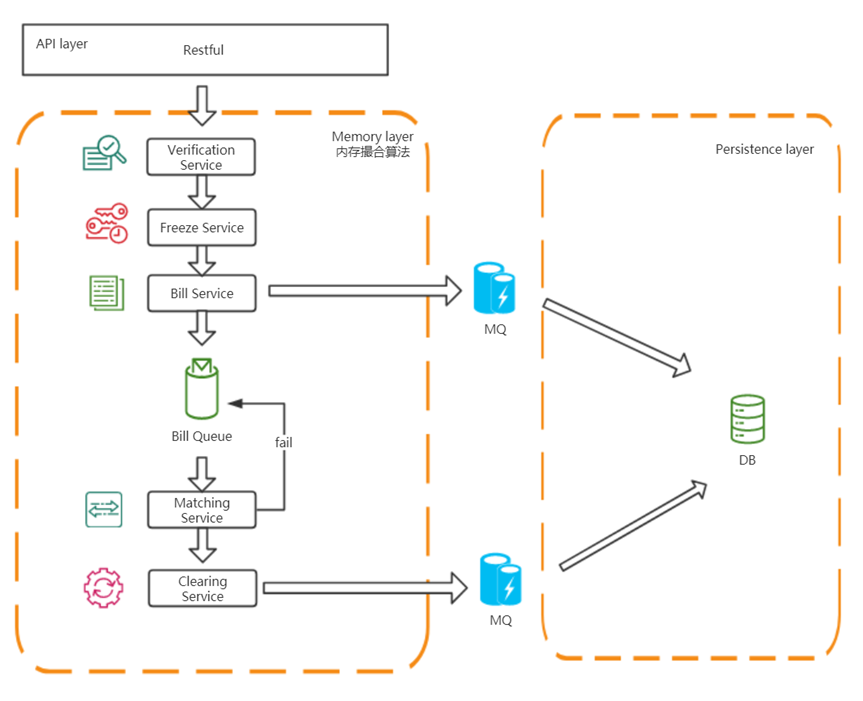
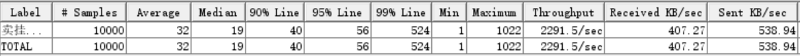
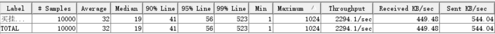

# 简单交易撮合系统设计文档

## 设计阐述

采用内存撮合模型，所有交易在内存中进行，通过避免交易过程中与DB 进行IO，能够提高交易速度；内存交易撮合完成后，将交易撮合信息传送至消息队列中，异步地在DB中持久化

## 总体架构

- API 层对用户暴露,提供三种接口
  - 增加用户及订单
  - 提交挂单请求
  - 实时监控
- 内存撮合模块
  - 在内存中进行撮合
  - 撮合结果发布至消息队列
  - 提高单次撮合速度,从而提高吞吐量
- 持久化模块
  - 异步持久化
  - 消费消息,持久化交易流水
  - 可拓展为DB撮合

## 模块设计

### 校验模块

校验模块负责校验请求参数的正确性,包括

- 包含必需的参数
- 参数值范围正确
- 参数值逻辑正确( 用户id与债券id合法)

### 冻结模块

挂单请求经过校验模块,校验成功后,冻结模块负责尝试冻结,主要分为两种:

- 将购买挂单,购买用户**金钱**的**可用余额**的相应部分冻结至**冻结余额**中
- 将出售挂单,出售用户所出售的**债券**的可用余额的**可用余额**的相应部分冻结至**冻结余额**中

如果冻结失败,向用户返回失败响应

如果冻结成功,**1.** 向用户返回请求成功响应 **2.** 生成挂单,进行内存撮合

### 挂单生成模块

冻结成功后,根据挂单请求生成对应的挂单

### 内存撮合模块

撮合在内存中进行,挂单队列库存放在内存中,交易撮合过程不与DB进行IO,增加挂单成交速度,提高吞吐量

#### 挂单队列库

**挂单队列库结构说明**

- 每个债券具有**买入**挂单队列与**卖出**挂单队列
- 队列顺序**价格优先、同价格下时间优先**
- **买入**挂单队列价格**从高至低**; **卖出**挂单队列价格**从低至高**
- 挂单队列库包含**多个债券**的挂单买卖队列

#### 撮合算法

**算法说明:**

> **以买入挂单为例**,说明挂单撮合算法,卖出挂单类似
>
> 撮合模块收到新的买入挂单后
>
> 查找是否存在符合**价格规则**(卖出价格小于或等于买入价格的挂单)的卖出挂单
>
> 如果存在,将第一个符合该价格规则的卖出挂单与买入挂单**撮合**
>
> 根据撮合规则计算买卖价格和买卖数量
>
> 尝试**清算**,生成交易流水
>
> 如果不存在合适卖出挂单或者清算失败,将买入挂单**存入买入队列**中,等待下一次撮合
>
> 如果清算成功,且买入挂单未全部完成,**重复上述过程**,**直至挂单全部完成**
>
> 上述算法维持了 **公平性** 的 特点

#### 限价交易的价格规则

- 卖出挂单价格为 **下限价格**,也即成交价不低于该价格
- 买入挂单价格为 **上限价格**,也即成交价不高于改价格
- **卖出 **价格 **不大于** **买入 **价格

#### 撮合规则

- 成交价为买卖挂单中先进入系统的限价
- 成交数量为买卖挂单中的较小值

### 清算模块

清算模块负责1. **完成**撮合计算完成的**交易 **2. 向消息队列**输出交易流水** 3. 记录交易流水日志

也即 **1.** 对于买方用户,在冻结余额中扣除相应金钱;增加相应债券 **2.**  对于卖方用户,在冻结债券余额中扣除相应债券,增加相应金钱 **3.** 结算挂单

**如果结算失败**,则进行回滚

### 持久化模块

持久化模块根据消息队列中的交易流水,将交易流水持久化

可以扩展为 DB 撮合模块

## 异常处理

异常处理包含三个层次 1. 用户请求错误导致的异常 2. 业务代码逻辑问题导致的异常 3. 底层依赖导致的异常

**用户请求错误导致的异常**

通过代码中的逻辑判断和返回值状态码返回给用户

**业务代码逻辑问题导致的异常**

如清算失败,正常情况下经过冻结余额,清算能够成功,如果因为业务逻辑代码bug导致的异常,应该

1. 提前判断可能出错的情况
2. 出错时打印错误日志,以备debug 和 修复代码
3. 回滚相应操作,并做合理处置或者重试

**底层依赖导致的异常**

如消息队列写失败等,应该

1. catch相应异常
2. 打印日志
3. 进行合理处置或者重试

## 实现测试目标

基于内存的撮合,能够提高单次交易速度,从而增大吞吐量

测试环境：

- Jmeter
- 模拟线程数100，循环次数100
- 场景：100个线程模拟一个用户随机请求卖出挂单；100个线程模拟10个用户随机买入挂单
- 压测文件 `.\matching-system\Test.jmx`

测试结果:

## 

